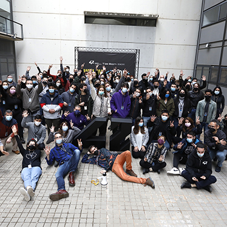

<h1 align="center">Hi  , welcome to my GitHub profile!</h1>

Who am I?🤨. Well, I'm Zsolt (or zpalfi), i'm a 19yo boy from Rumania 🇷🇴 currently living in Barcelona 🇪🇸. I love coding and face challenges that'll make my brain fire. I also like music and I play different instruments (Saxophone, Tuba, Trombone).

## 📖 My academic life

### ♦️ UPC University ♦️

I started studying Electronic engineering in the UPC in Catalonia. But after a year I wasn't shure if that is what I wanted so I decided to turn my life around and I began the 42 piscine in Barcelona.

 
  

### ♦️ 42 School ♦️

🤨 What is 42 School? 42 is a future-proof computer science training to educate the next generation of software engineers. The 42 program takes a project-based approach to progress and is designed to develop technical and people skills that match the expectations of the labor market.

If you want to see my progress at 42 Barcelona you can follow it [here](https://github.com/zpalfi42/42_Cursus_zpalfi).

  
  
  

 
  

## Social media

