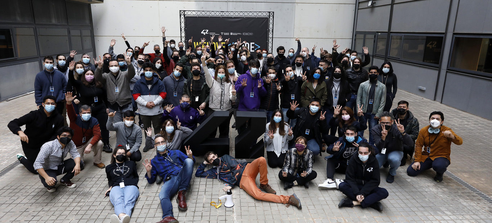

<h1 align="center">Hi  , welcome to my GitHub profile!</h1>

Who am I?🤨. Well, I'm Zsolt (or zpalfi), I'm a guy from Romania 🇷🇴 currently living in the vibrant city of Barcelona 🇪🇸. I have a genuine passion for coding and I'm always eager to tackle challenges that stimulate my mind and push my problem-solving abilities. Beyond the digital world, I also have a deep appreciation for music and enjoy playing various instruments, including the Saxophone, Tuba, and Trombone.

## 📖 My academic life

### ♦️ UPC University ♦️

I initially embarked on my higher education journey by studying Electronic Engineering at the prestigious Polytechnic University of Catalonia (UPC) in Barcelona. However, after a year of exploration, I realized that my true calling lay elsewhere. This led me to a significant turning point where I decided to immerse myself in the intensive and innovative 42 piscine program in Barcelona.

 
  

### ♦️ 42 The Network ♦️

🤨 What is 42 The Network? For those unfamiliar, 42 is a groundbreaking and future-oriented computer science training program designed to cultivate the next generation of highly skilled software engineers. Unlike traditional academic paths, the 42 program utilizes a project-based learning approach, where progress is achieved through practical application and peer-to-peer learning. This unique methodology is specifically crafted to develop both strong technical proficiencies and essential interpersonal skills that are highly valued in today's dynamic labor market.

I successfully graduated from the rigorous 42 program in January 2024. Following this significant achievement, I decided to pursue further academic growth and embarked on a new educational journey in January 2025.

### ♦️ Master's Degree in IT Systems Architecture, Networks, Databases, and Data (AI & Algorithms track) RNCP39774 ♦️

Continuing my pursuit of knowledge and specialization, in January 2025, I began my path to achieve a Master's degree in IT Systems Architecture with a strong focus on Artificial Intelligence (AI) and Algorithms. This advanced degree program is also part of the esteemed 42 The Network ecosystem, allowing me to build upon the strong foundation I gained during the initial 42 program.

 

### 👋 **Check out my brand new portfolio website for a more detailed overview of my projects and skills:** [https://zpalfi42.github.io](https://zpalfi42.github.io)

 
 

  
  
  

 
  

## Social media

